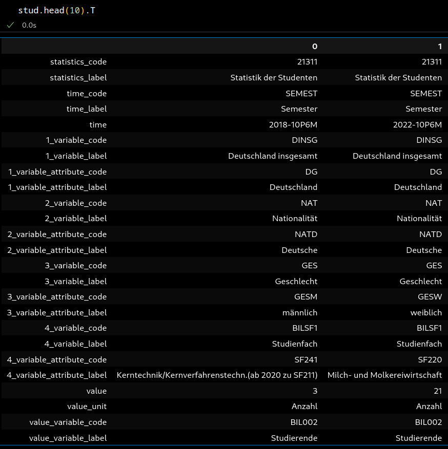
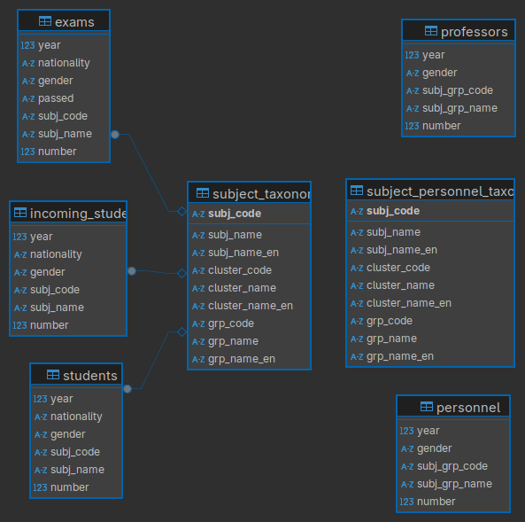
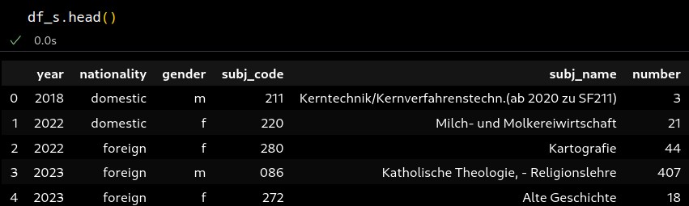
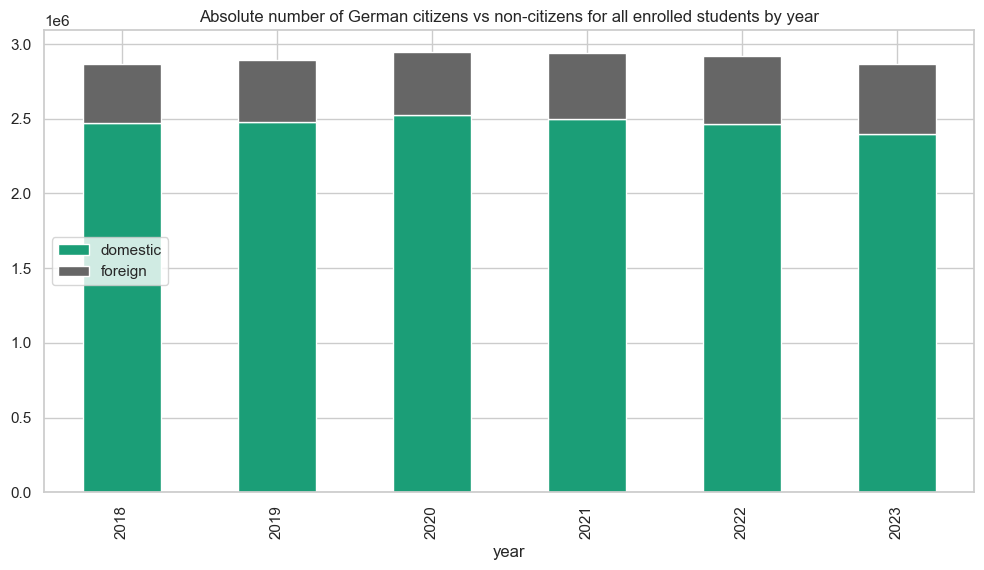
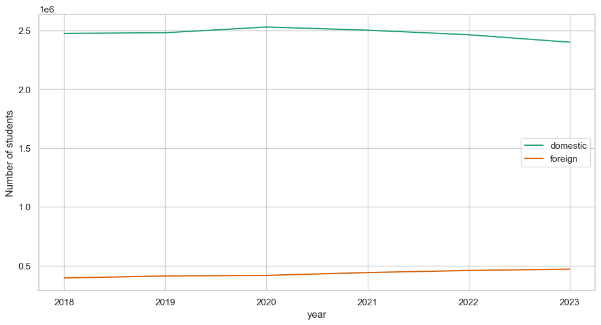
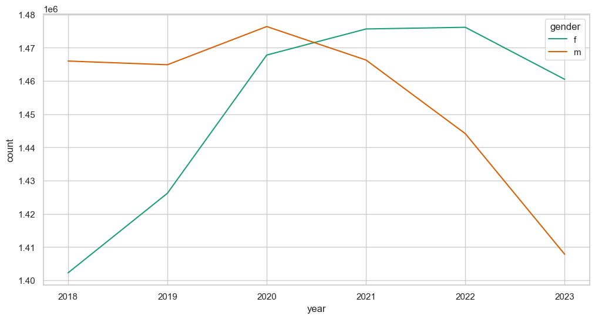
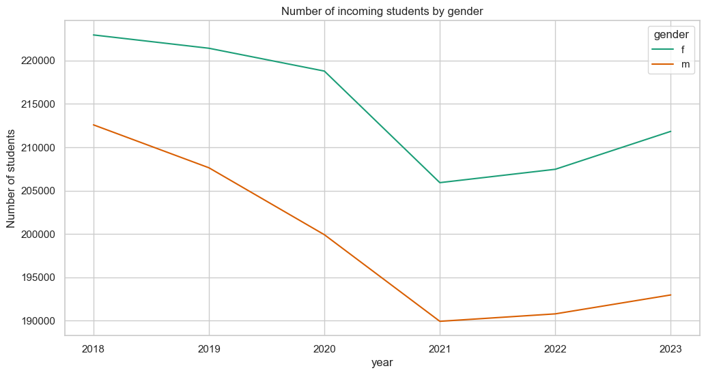
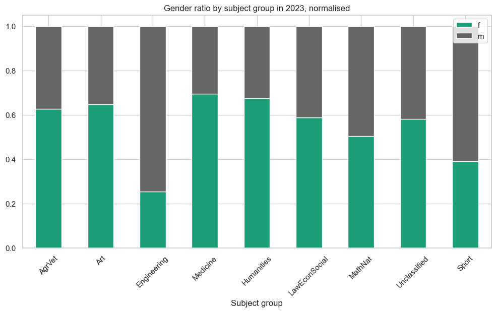
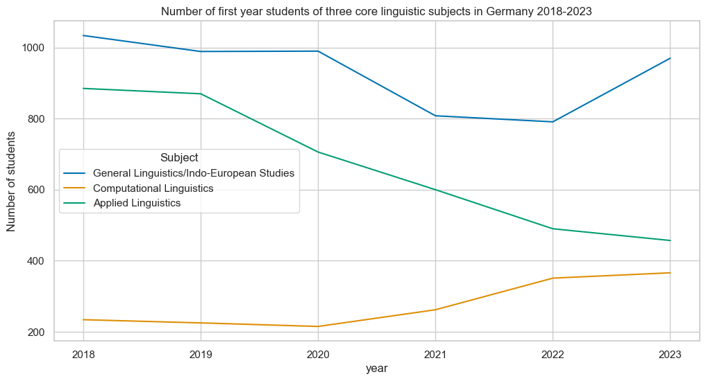

## Overview

\tableofcontents

# Introduction

## Database

- source: Federal Statistical Office ([www-genesis.destatis.de](https://www-genesis.destatis.de/))
- 5 datasets concerning subjects of study (plus gender and -- partly -- nationality)
  1. total number of students
  2. number of incoming students
  3. number of final exams (with information about result: passed/not passed)
  4. number of personnel by subject cluster
  5. number of professors by subject group
- effectively used for now: 1 and 2
- selected time frame: 2018--2023
- also: taxonomies for subjects \< subject clusters \< subject groups <!---->
  - 2 distinct versions for study subjects and personnel (pdfs)


## Questions for SQL queries

1. What was the total number of students in Germany in 2023/24?
2. Overall top 10 subjects in 2023/24
3. Overall gender distribution of students in 2023/24
4. Gender distribution in the 5 most studied subjects in 2023/24
5. What were the top subjects by gender?
6. Top 10 subjects studied by foreign students
7. Distribution of the student numbers across subject groups
8. Change of yearly intake by group over time period
9. Change of yearly intake for language related subjects
10. Change of yearly intake for linguistic subjects only
11. 10 subjects with highest percentual drop in intake
12. 10 subjects with highest percentual rise in intake


# Data preparation

## Challenge 1: Data formating and cleaning

- data available in several formats: xls, csv and csv-flat
  - first two not practical for automatic processing
- csv-flat: extensible, but verbose format
- every property described by 4 columns
  - `variable_code`: code for the encoded variable
  - `variable_label`: plain text label for variable
  - `variable_attribute_code`: code for attribute/value assigned to variable
  - `variable_attribute_label`: plain text label for the attribute/value
- similarly for time, target value


##




## 


### Tasks

- extract only relevant data
- normalise data 
  - time marked by semesters for total students and incoming students table, plain year elsewhere
  - subject codes in student-related tables prefixed by 'SF'
  - format for cluster and group codes in personnel/professorial data is even more messy


## Challenge 2: Taxonomies

- grouping of subjects should follow established standards
- two distinct taxonomies
  - the personnel-related one has some overlap in the titles, but codes are completely distinct from the study-related scheme
- only available as pdfs
- translations would be helpful for presentation

### Extraction

- employ LLMs to generate csv or JSON incl. translations
- JSON should be computationally more effective (less energy waste?)
- multiple incomplete attempts with ChatGPT, Claude
- only Gemini produced a well-formed and (almost) complete JSON (probably?)

# Implementation

## General workflow

- database setup (see below)
- dictionary to store information on each dataframe
  - location for csv
  - name for db table
  - after creation: reference to actual df
  - (also bool for whether student-related, but unused)
- transform JSON of taxonomies into dataframes
 - append to database tables
- define and run cleaning function on 5 dataframes

## Database setup

- using `sqalchemy` to set up database connection and tables
- drop and recreate tables on each run (allows appending of data)

{ height=68% }


## Cleaning function

`def clean_dat(in_df, dstore, dbengine, dropcols, rencols,complexdate=False,insgesamt=False)`

- input
  - source dataframe
  - dictionary entry for target dataframe
  - SQL engine
  - list of columns to drop
  - dictionary of column renames
  - switches for special data treatment
- performs necessary cleaning operations depending on dfs
  - drop and rename columns
  - replace deprecated subject codes where appropriate
- save cleaned csv file based on location info in `dstore` dictionary
- append table to database table defined in `dstore` 
- return cleaned dataframe

## `df_s.head()`

{ height=140% }

# EDA

##

### Practical complication

- data already aggregated by gender, (nationality), subject
- standard functions like `.describe()` or `.count()` of limited use
- instead: use `.sum()` aggregation function where relevant 

### General insights

- number of students is dropping over timeframe
- at least partly connected to COVID
  - marked drop from 2020 to 2021
  - moderate rise from 2022 to 2023
  
  
##

- shows overall slight drop




## 

- COVID-drop among domestic students
- number of foreign student rose slightly over COVID (remote accessibility?) 




## Gender over time 



- total number of female student population overtook male population in 2021


##

- not directly due to COVID, probably longer trend




## Gender x subject group





## Chi²-test


\small

| **Subject group**                                             |      **f** |   **f\textsubscript{expected}** |     **m** |   **m\textsubscript{expected}** |
|:--------------------------------------------------------------|-------:|-------------:|-------:|-------------:|
| AgricForestNutriVet 						|  37981 |     30922.9  |  22750 |     29808.1  |
| Art, Art History                                              |  63354 |     49814.9  |  34480 |     48019.1  |
| Engineering Sciences                                          | 189389 |    381224    | 559316 |    367481    |
| Medicine/Health Sciences                                      | 143746 |    105417    |  63288 |    101617    |
| Humanities                                                    | 200420 |    151479    |  97078 |    146019    |
| Law, Economics, Social Sciences                            | 657197 |    568559    | 459425 |    548063    |
| Mathematics, Natural Sciences                                 | 151683 |    153177    | 149149 |    147655    |
| Outside Classification                              		|   4534 |      3975.66 |   3274 |      3832.34 |
| Sport                                                         |  12177 |     15910.3  |  19070 |     15336.7  |

$\chi^2=298192, df=8, p < 0.01$ <!-- -->

*There is a statistically significant interaction between gender and subject group.*


# Selected SQL prompts

## 6. Which were the top 10 subjects studied by foreigners? 


```sql
SELECT st.subj_name_en,SUM(number) AS total_number
FROM students s 
LEFT JOIN subject_taxonomy st 
   ON s.subj_code = st.subj_code
WHERE s.nationality = 'domestic' AND s.year = 2023 
GROUP BY s.subj_code
ORDER BY total_number DESC
LIMIT 10;

```

##

\small

|    | overall                     | domestic                    | foreign                                  |
|---:|:----------------------------|:----------------------------|:-------------------------------------------------|
|  1 | Business Adm.     | Business Adm.     | Business Adm.                          |
|  2 | Computer Sc.            | Computer Sc.            | Computer Sc.                                 |
|  3 | Law                         | Law                         | Elec. Engineering               |
|  4 | Psychology                  | Psychology                  | Mech. Engineering                           |
|  5 | Medicine 	    	   | Medicine 			 | Int. Business Adm. |
|  6 | Economic Sc.           | Social Work                 | Medicine                     |
|  7 | Social Work                 | Economic Sc.           | Economic Sciences                                |
|  8 | Mech. Engineering      | Mech. Engineering      | Indust. Engineering				    |
|  9 | Business Informatics        | German Studies       | Civil Engineering        |
|  10 | German Studies       | Business Informatics        | Law                                              |


## 10. Intake changes for linguistic subjects?


\small
```sql
SELECT st.subj_name_en, is2.year, SUM(is2.number) AS student_number
FROM incoming_students is2 
LEFT JOIN subject_taxonomy st ON is2.subj_code = st.subj_code
WHERE is2.subj_code IN ('152','284','160')
GROUP BY is2.subj_code, is2.year
ORDER BY is2.subj_code, is2.year;

```


{ height=50% }


# Conclusion

## 

### Technical lessons

- data integration is fun(ky)
- data formats can be a mess to sort out
- extraction from pdfs via LLMs can be viable, but beware limits and errors
  - best result with Gemini
  - still at least two missing data points
- keeping jupyter notebooks tidy is tricky
  - moving cells is a pain in VSCode
- dictionaries are great for central metadata storage


### Content-wise

- many more interesting aspects in data
- inspecting longer timeframes would highlight trends more clearly


## 

\centering\LARGE Thanks for your attention!


